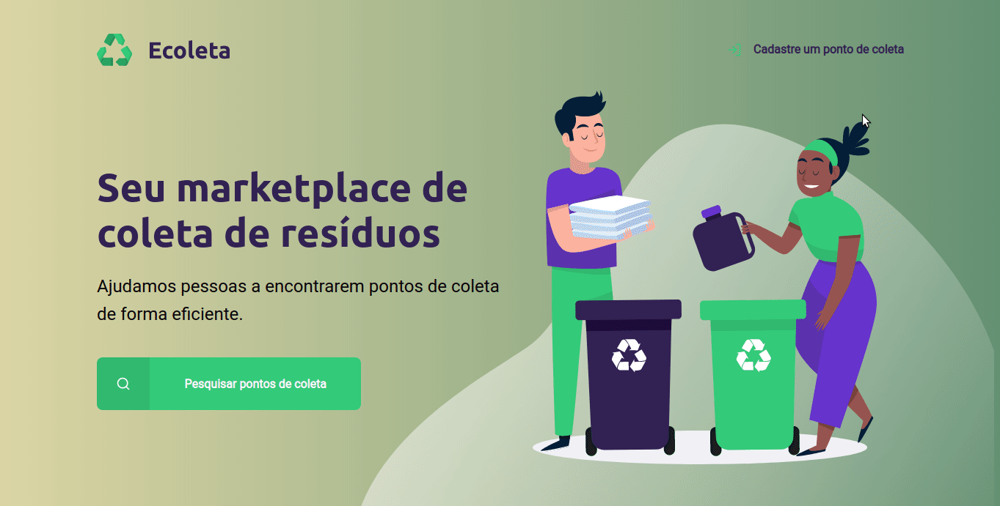

<h1 align=center>

</h1>

<h4 align="center"> 
♻️ NextLevelWeek 1.0 ♻️ <br/> 🚀 Done! ✔️
</h4>

---

## 📑️ Índice

- [Next Level Week](#ℹ%EF%B8%8F-o-que-é-a-next-level-week)
- [O projeto](#-📝️-sobre)
- [Tecnologias utilizadas](#-🚀️-tecnologias-utilizadas)
- [Acrescentado ao projeto original](#-💻️-acrescentado-ao-projeto-original)
- [Como usar](#-💾️-como-baixar/testar-o-projeto)
- [Contato](#-desenvolvido-com-💙️-por:)

---

## ℹ️ O que é a Next Level Week

A NLW é uma semana prática com muito código, desafios, networking e um único objetivo: levá-lo ao próximo nível. Através do nosso método, você aprenderá novas ferramentas, aprenderá sobre novas tecnologias e descobrirá hacks que irão impulsionar sua carreira. Um evento online e totalmente gratuito que o ajudará a dar o próximo passo na sua evolução como desenvolvedor.

### Dias
Dia 1: Acelerando sua evolução 01/06 - ✔️ <br/>
Dia 2: Olhando para as oportunidades 02/06 - ✔️ <br/>
Dia 3: A escolha da Stack 03/06 - ✔️ <br/>
Dia 4: Até 2 anos em 2 meses 04/06 - ✔️ <br/>
Dia 5: Milha extra 05/06 - ✔️

---

<h1 align=center>

</h1>

<h1>

</h1>

## 📝️ Sobre

O projeto **Ecoleta** é um marketplace de coleta de resíduos para descarte ecológico que foi proposto na **Next Level Week - Trilha Starter** da Rocketseat com intuito de criar uma aplicação web em uma semana e praticar os conceitos propostos. O tema foi escolhido em comemoração à semana do meio ambiente.

---

## 🚀️ Tecnologias utilizadas

O projeto foi desenvolvido utilizando as seguintes tecnologias:

- HTML
- CSS
- JavaScript
- NodeJS
- npm
- ExpressJS
- Nunjucks
- Nodemon
- SQLite3

---

## 💻️ Acrescentado ao projeto original

- Background estilizado
- Animações aos botões
- Responsividade para para todos os dispositivos existentes no device toolbar do Chrome. 🚧️

---

## 💾️ Como baixar/testar o projeto

- Você irá precisar instalar o [Git](https://git-scm.com/), [NodeJS](https://nodejs.org/pt-br/download/) + [npm](https://www.npmjs.com/get-npm):

```bash
# Versões mínimas ou superiores.
$ node -v
v12.18.0

$ npm -v
6.14.4
```

- Para configurar, no bash digite os seguinte códigos:

```bash
# Clonar o repositório
$ git clone https://github.com/jeanmontt/NLW-1.0.git

#Entrar no diretório
$ cd NLW-1.0

#Instalar as dependências
$ npm install

#Iniciar o local host
$ npm start
```

- Por ultimo abra seu navegador e digite:

```
localhost:3000
```

---

#### Desenvolvido com 💙️ por:

***Jean Monteiro*** 
<br/> 
<a href="https://www.linkedin.com/in/jeanmont/">

</a>